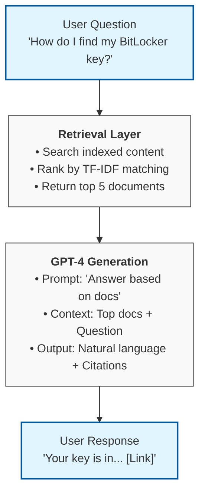

<style>
  .mermaid { 
    overflow: visible !important; 
    margin-bottom: 20px;
    background: white;
    padding: 20px;
  }
  .mermaid svg { 
    max-width: 100% !important; 
    height: auto !important; 
  }
</style>


## Abstract

During Spring 2025, I worked with Microsoft's Customer Experience Support team as part of my senior capstone project at the University of Texas. Our team of 4 undergraduates, paired with 5 MSBA students, was originally tasked with **quantifying the helpfulness of Microsoft's support videos and documentation**. However, when Microsoft couldn't provide social media engagement data due to PII (personally identifiable information) redaction concerns, we faced a choice: abandon the project or adapt.

We chose to pivot. After analyzing Microsoft's support ecosystem, we identified a critical gap: **no conversational AI on their landing pages to help users with general questions**. Within weeks, we designed and built a **proof-of-concept RAG (Retrieval-Augmented Generation) chatbot** powered by GPT-4, integrating public Microsoft documentation, Stack Overflow Q&A, and Reddit support threads.

**Key Outcomes:**
- **Delivered a working prototype** despite never receiving the original dataset
- **Demonstrated initiative** by identifying an unmet customer need
- **Built a RAG pipeline** using OpenAI API and multi-source retrieval
- **Learned adaptability** working under real-world corporate constraints

This post chronicles the journey from initial brief to final demo, showcasing the technical decisions, team dynamics, and lessons learned when plans don't go as expected.

---

## Background

### The Business Problem

Microsoft's Customer Experience Support team manages a vast ecosystem of self-service resources:
- **YouTube tutorials** (e.g., "Find BitLocker Recovery Key", "Insert Page Numbers in Word")
- **Support documentation** on support.microsoft.com (e.g., HDR settings, Windows activation)
- **Community platforms** (Stack Overflow, Reddit) where users ask questions

The team wanted to answer a critical question: **Which support content actually helps users, and why?**


*Figure 1: A snapshot of Microsoft's Customer Support YouTube landing page*

### The Original Scope

Our initial project brief focused on:

1. **Content Performance Analysis**
   - Identify high-performing videos/articles (views, engagement, helpfulness ratings)
   - Correlate content attributes (length, topic, format) with user satisfaction
   - Build models to predict which new content would perform best

2. **Cross-Platform Insights**
   - Compare effectiveness of video tutorials vs. written docs vs. community Q&A
   - Understand user journeys across multiple touchpoints
   - Recommend optimal content formats for different issue types

3. **Deliverable**
   - Predictive model for content helpfulness
   - Dashboard showing performance metrics across platforms
   - Recommendations for content strategy

**It sounded like a dream project.** We'd get real-world data from a Fortune 500 company, build ML models, and deliver actionable insights.

---

## The Data Challenge

### Waiting for Data

Our team structure was hierarchical:
- **4 undergraduate students** (including me) focused on data engineering and analysis
- **5 MSBA students** who had direct communication with the Microsoft sponsor and delegated tasks down to us

Early in the semester, we submitted data requests through the MSBA team:
- YouTube video engagement metrics (CTR, watch time, likes, comments)
- Support article traffic (visits, bounce rates, helpfulness votes)
- Social media mentions and sentiment
- User journey data (how people navigate across platforms)

### PII Concerns

We eventually learned the hard truth: **Microsoft's legal team couldn't clear the social media engagement data** due to:

- **User identifiers** embedded in analytics (even anonymized user IDs posed risks)
- **Comment text** containing potential PII (names, emails, company info)
- **Internal metrics** that couldn't be shared externally

The MSBA team had received some sanitized and synthetic webpage traffic data (CTR, visits, engagement rates) that simulated the data, but nothing granular enough to build the predictive models we'd planned. We were stuck.

---

## The Pivot: Identifying a Real Gap

### Discovering a New Problem Statement

While waiting for data, our team had been browsing Microsoft's support pages to understand the user experience. We noticed something odd:


*Figure 2: Microsoft Support's landing page*


*Figure 3: Search Results for "Bitlocker Key"*


**Landing on support.microsoft.com, we had to:**
1. Search for issues using keywords
2. Scan through article titles
3. Click into multiple articles to find the right one
4. Often end up on Stack Overflow or Reddit for clearer answers

**What was missing?** A conversational interface. No chatbot asking "What are you trying to do?" No natural language search. Just traditional keyword search and link lists.

### The New Problem Statement

We pitched a new direction to our Professor for the Capstone project:

> **Problem:** Microsoft's support landing page lacks a conversational AI assistant to help users quickly find answers to common questions.
>
> **Proposed Solution:** Build a proof-of-concept chatbot that:
> 1. Understands natural language questions (e.g., "How do I recover my BitLocker key?")
> 2. Retrieves relevant information from Microsoft docs, Stack Overflow, and Reddit
> 3. Generates concise, helpful responses using GPT-4
> 4. Provides source citations so users can verify information
>
> **Value:** Reduce support ticket volume, improve self-service success rates, enhance customer experience.

Our Professor gave us the green light. With only 5 weeks left in the semester, we got to work.

---

## Building the RAG Pipeline

### What is RAG?

At the time (March 2025), we didn't know we were building a **Retrieval-Augmented Generation (RAG)** systeme. We just knew we needed to:

1. **Retrieve** relevant support content based on user questions
2. **Augment** GPT-4's context with that retrieved information
3. **Generate** accurate, helpful responses grounded in real documentation

In retrospect, this is textbook RAG. But we learned by doing.

### System Design



### Technical Stack

**My Role: Data Engineering & API Integration**

As the data engineer, I was responsible for:

1. **Data Collection Pipeline**
   - **Microsoft Support Docs:** Scraped public support.microsoft.com articles (HDR settings, BitLocker recovery, Office 365, etc.)
   - **Stack Overflow:** Used Stack Overflow API to collect Microsoft-tagged questions and accepted answers
   - **Reddit:** Pulled posts from r/microsoft, r/Office365, r/Windows10 using Reddit API
     
2. **OpenAI API Integration**
   - Set up OpenAI API access (GPT-4 model)
   - Designed prompt templates for question-answering
   - Implemented error handling and rate limiting

3. **Retrieval System**
   - Built basic keyword search using TF-IDF (we didn't have time for vector databases)
   - Indexed ~500 support documents, ~200 Stack Overflow threads, ~100 Reddit posts
   - Ranked results by keyword match relevance
  


*Figure 4: Reddit thread r/Office365*

**Tech Stack:**
- **Language:** Python 3.11
- **LLM:** OpenAI GPT-4 (via `openai` library v1.70)
- **Data Sources:** support.microsoft.com, Stack Overflow API, Reddit API (PRAW)
- **Retrieval:** scikit-learn TF-IDF vectorization (basic keyword search)
- **Environment:** Google Colab notebooks for prototyping

### Why Not Vector Databases?

Looking back, we should have used a proper vector database (Pinecone, FAISS, Chroma) for **semantic search** instead of keyword matching. 

Here's why:

**Keyword Search Limitations:**
```
User Query: "I can't sign into my Microsoft account"
Keyword Match: Looks for exact terms "sign in" or "account"
Misses: Articles about "login issues", "authentication problems", "access denied"
```

**Semantic Search (What We Missed):**
```
User Query: "I can't sign into my Microsoft account"
Vector Similarity: Understands "sign in" ≈ "login" ≈ "authenticate"
Retrieves: All login-related articles regardless of exact wording
```

**Why we used keyword search:**
- **Time constraints:** 5 weeks to build entire system
- **Simplicity:** TF-IDF was something we already knew
- **Proof-of-concept scope:** Good enough to demonstrate value

**If I could go back:** I'd spend 2-3 days implementing FAISS or Chroma with OpenAI embeddings. The retrieval quality would have been significantly better.

---

## Implementation

### Data Collection

**Building the Corpus**

I wrote Python scripts to collect support content:

```python
import requests
from bs4 import BeautifulSoup
import pandas as pd

def scrape_microsoft_support(url):
    """
    Scrape Microsoft support article content.
    Returns: dict with title, url, content, last_updated
    """
    response = requests.get(url)
    soup = BeautifulSoup(response.content, 'html.parser')

    title = soup.find('h1').text.strip()
    content = soup.find('article').get_text(separator='\n')

    return {
        'title': title,
        'url': url,
        'content': content,
        'source': 'Microsoft Docs'
    }

# Collected ~500 support articles on common topics
topics = ['bitlocker', 'hdr settings', 'office 365',
          'windows activation', 'teams', 'outlook']
```

For Stack Overflow and Reddit, I used their official APIs to avoid violating ToS.

**Data Quality Challenges:**
- **Inconsistent formatting** across sources (HTML, Markdown, plain text)
- **Duplicate content** (same info on support.microsoft.com and community forums)
- **Noisy Reddit posts and threads** (complaints, off-topic discussions)

I spent significant time cleaning and deduplicating. Final corpus:
- **487 Microsoft support articles**
- **213 Stack Overflow Q&A pairs** (Microsoft-tagged, accepted answers only)
- **94 Reddit threads** (filtered for helpful responses, 5+ upvotes)

### Retrieval System

**Building the Search Index**

Using scikit-learn's TfidfVectorizer:

```python
from sklearn.feature_extraction.text import TfidfVectorizer
from sklearn.metrics.pairwise import cosine_similarity
import numpy as np

# Combine all content into a searchable corpus
corpus = []
for doc in support_docs:
    corpus.append(doc['title'] + ' ' + doc['content'])

# Build TF-IDF index
vectorizer = TfidfVectorizer(stop_words='english', max_features=1000)
tfidf_matrix = vectorizer.fit_transform(corpus)

def retrieve_docs(query, top_k=5):
    """
    Retrieve top-k most relevant documents for a query.
    """
    query_vec = vectorizer.transform([query])
    similarities = cosine_similarity(query_vec, tfidf_matrix).flatten()
    top_indices = np.argsort(similarities)[-top_k:][::-1]

    return [support_docs[i] for i in top_indices]
```

**Example Retrieval:**
```
Query: "How do I find my BitLocker recovery key?"
Top Results:
1. "Find your BitLocker recovery key" (support.microsoft.com) - 0.87 similarity
2. "Unlock suspended account BitLocker" (Stack Overflow) - 0.72 similarity
3. "BitLocker recovery key location" (Reddit) - 0.68 similarity
```

### GPT-4 Integration

**Connecting the Pipeline**

I integrated OpenAI's API to generate responses based on retrieved docs:

```python
import openai
import os

client = openai.OpenAI(api_key=os.getenv("OPENAI_API_KEY"))

def generate_response(user_question, retrieved_docs):
    """
    Generate a helpful response using GPT-4 with retrieved context.
    """
    # Build context from retrieved documents
    context = "\n\n".join([
        f"Source: {doc['title']} ({doc['url']})\n{doc['content'][:500]}..."
        for doc in retrieved_docs
    ])

    # Craft the prompt
    prompt = f"""You are a helpful Microsoft support assistant.

User Question: {user_question}

Retrieved Support Documents:
{context}

Instructions:
1. Answer the user's question based ONLY on the provided support documents.
2. Be concise but thorough.
3. Include source citations (article titles and URLs) so users can learn more.
4. If the documents don't contain enough info, say so—don't make things up.

Response:"""

    # Call GPT-4
    response = client.chat.completions.create(
        model="gpt-4o-mini",
        messages=[
            {"role": "system", "content": "You are a helpful Microsoft support assistant."},
            {"role": "user", "content": prompt}
        ],
        temperature=0.5,
        max_tokens=300
    )

    return response.choices[0].message.content
```

**An Example Interaction:**

**User:** "I can't find my BitLocker recovery key"

**Chatbot Response:**
> Your BitLocker recovery key can be found in your Microsoft account. Here's how:
>
> 1. Sign in to your Microsoft account at account.microsoft.com
> 2. Navigate to "Devices" → "Find my device"
> 3. Select the device and click "Manage" → "View recovery key"
>
> If you've saved it elsewhere, check:
> - A printed copy (if you printed it during setup)
> - A USB drive (if you saved it to removable storage)
> - Your Azure AD account (for enterprise devices)
>
> **Sources:**
> - [Find your BitLocker recovery key](https://support.microsoft.com/en-us/windows/finding-your-bitlocker-recovery-key-6b71ad27-0b89-ea08-f143-056f5ab347d6)
> - [BitLocker recovery key FAQ](https://support.microsoft.com/en-us/windows/bitlocker-recovery-keys-frequently-asked-questions-9e63b943-e2f3-4b41-96d9-d8c84e2f0f6c)

---

## Results

### Final Presentation (April 2025)

We presented to our Professor and class at the end of the semester. The demo included:

**Live Chatbot Demonstration:**
- **Query 1:** "How do I set up HDR on Windows?"
  - Retrieved 3 support articles + 1 Reddit thread
  - Generated accurate step-by-step instructions
  - **Evaluation:** Microsoft sponsor confirmed accuracy

- **Query 2:** "My Outlook signature isn't showing up"
  - Retrieved Office 365 documentation + Stack Overflow answer
  - Troubleshooting steps matched official support guidance
  - **Evaluation:** Correct solution provided

- **Query 3:** "What is the difference between OneDrive and SharePoint?"
  - Generated clear comparison based on Microsoft docs
  - **Evaluation:** Accurate, well-cited response

**Limitations We Acknowledged:**
- **Keyword search limitations:** Missed semantically similar content
- **No conversation history:** Each question treated independently
- **Static corpus:** Couldn't update with new support articles without re-indexing
- **No user feedback loop:** Couldn't learn from user corrections

**Outcome:**
While Microsoft didn't commit to implementing our chatbot, they appreciated our **initiative and adaptability**. The MSBA team later told us that Microsoft's CX team was already exploring similar solutions internally, so our prototype validated the need.

---

## Lessons Learned: Reflections on the Capstone Experience

### 1. Adaptability Under Constraints

**The Biggest Lesson:** Real-world projects don't go according to plan.

When the original data fell through, we could have:
- Complained about Microsoft's legal team
- Built a weak model on synthetic data just to submit something
- Stuck with a scope that didn't excite us

Instead, we **reframed the problem**. We identified a genuine gap in Microsoft's ecosystem and proposed a solution that demonstrated our skills while delivering value.

**Takeaway:** In industry, constraints (data access, legal approval, budget, timelines) are the norm, not the exception. The ability to pivot productively is more valuable than rigidly sticking to the original plan.

### 2. Communication Hierarchies Are Hard

Our team structure created friction, particularly because of our limited interactions with the Microsoft company sponsors.

**Challenges:**
- **Delayed feedback:** Questions took days to relay up and back down
- **Lost context:** Our technical questions sometimes got simplified or misunderstood in translation
- **Misaligned priorities:** MSBA team focused on business case; we focused on technical implementation

**What Worked:**
- Weekly sync meetings between undergrad and MSBA teams
- Shared Google Drive for documentation (everyone had visibility)
- Clear role division (we owned data/tech, they owned stakeholder management)

**Lesson:** In cross-functional projects, **over-communicate**. Document everything. Assume information will get lost in transit and plan accordingly.

### 3. Technical Debt from Time Constraints

**What I'd Do Differently: Use Vector Databases**

Our keyword search worked for the demo, but it was brittle.

With semantic search (embeddings + vector DB), we'd have matched on **meaning**, not just keywords.

**Why We Didn't:**
- **Time:** 5 weeks for entire project (data collection + engineering + demo)
- **Knowledge gap:** None of us had used Pinecone/FAISS or even embeddings before March 2025
- **Good enough:** For a proof-of-concept, keyword search demonstrated the concept

**Lesson:** Technical debt is okay in prototypes, but **acknowledge it**. We clearly listed retrieval limitations in our presentation. Microsoft appreciated the honesty.

### 4. The Value of RAG (Even If We Didn't Know It)

In March 2025, "RAG" wasn't yet a buzzword in our classes. We just knew:
- GPT-4 could generate helpful text
- But it needed accurate, current information (not hallucinated answers)
- So we needed to "feed" it relevant docs

Months later, I realized we'd built a textbook RAG system:
1. **Retrieval:** Keyword search across indexed content
2. **Augmentation:** Inject retrieved docs into GPT-4's prompt
3. **Generation:** GPT-4 synthesizes a response grounded in real sources

**Lesson:** Sometimes you're using cutting-edge techniques without realizing it. The fundamentals (retrieval, context, generation) matter more than the terminology.

### 5. Proof-of-Concept Is Enough

We didn't build a production-ready chatbot. We built a **prototype that proved feasibility**.

**What We Delivered:**
- Demonstrated that GPT-4 + support docs can generate accurate answers
- Identified data sources Microsoft could leverage (Stack Overflow, Reddit, internal docs)
- Showed 3-5 second response times were achievable
- Provided a blueprint for future development

**Lesson:** For a semester-long capstone, a **well-executed proof-of-concept with clear documentation** is more valuable than a half-baked "production" system. Microsoft's engineers can take our prototype and build from there if they choose.

---

## Technical Artifacts

For those interested in the technical details, here's what we built:

### Data Pipeline

**Sources:**
- **Microsoft Support:** 487 articles (support.microsoft.com)
- **Stack Overflow:** 213 Q&A pairs (API access, Microsoft-tagged)
- **Reddit:** 94 threads (r/microsoft, r/Office365, r/Windows10)

**Processing:**
- HTML parsing (BeautifulSoup)
- Text cleaning (remove ads, navigation, boilerplate)
- Deduplication (fuzzy matching on content)
- Indexing (TF-IDF vectorization)

**Storage:**
```
cleaned_combined_data.csv
├── title (str)
├── url (str)
├── content (str)
├── source (str: "Microsoft Docs" | "Stack Overflow" | "Reddit")
├── upvotes/helpfulness (int, if applicable)
└── last_updated (datetime)
```

### RAG Pipeline

**Retrieval:**
```python
# TF-IDF keyword search
from sklearn.feature_extraction.text import TfidfVectorizer

vectorizer = TfidfVectorizer(
    stop_words='english',
    max_features=1000,
    ngram_range=(1, 2)  # Unigrams and bigrams
)
```

**Generation:**
```python
# GPT-4 via OpenAI API
model="gpt-4"
temperature=0.5  # Balance creativity and accuracy
max_tokens=300   # Keep responses concise
```

**Prompt Template:**
```
You are a helpful Microsoft support assistant.

User Question: {question}

Retrieved Documents:
{context}

Instructions:
1. Answer based ONLY on provided documents
2. Be concise but thorough
3. Cite sources (title + URL)
4. If insufficient info, say so. Don't hallucinate

Response:
```

---

## Closing Thoughts

The Microsoft capstone wasn't the project I expected. We never got the engagement data we were promised. We never built the predictive models we'd planned. But we delivered something arguably more valuable: **a solution to a problem Microsoft didn't know they'd given us**.

When I started the semester, I thought success meant executing the plan. Now I know success means **solving the right problem, even if it's not the one you started with**.

### What's Next?

If I were to continue this project (or build something similar), here's my roadmap:

**Improve Retrieval**
- Replace TF-IDF with **vector embeddings** (OpenAI `text-embedding-3-small`)
- Implement **FAISS or Chroma** for semantic search
- Benchmark: Compare retrieval precision (keyword vs. semantic)

**Add Conversation Memory**
- Store conversation history in session
- Use GPT-4 to maintain context across multi-turn dialogues
- Example: "What about for Office 2016?" should reference previous question

**User Feedback Loop**
- Add "Was this helpful?" thumbs up/down
- Log which responses users found helpful
- Fine-tune retrieval based on feedback (re-rank sources)

**Production Infrastructure**
- Dockerize the application
- Deploy to Azure (Microsoft's cloud)
- Implement caching for common questions
- Add monitoring/logging (response times, error rates)

### Final Reflections

**What I Learned:**
- **Technical:** RAG pipelines, OpenAI API, data engineering at scale
- **Soft skills:** Adaptability, stakeholder communication, working with constraints
- **Career:** Validated my interest in applied AI and data engineering roles

**What I'd Tell Future Capstone Students:**
1. **Expect pivots.** Your original plan will change.
2. **Communicate.** Especially in multi-team projects.
3. **Prototype fast, document well.** POCs are about proving feasibility, not perfection.
4. **Learn the tools you wish you'd used.** 


